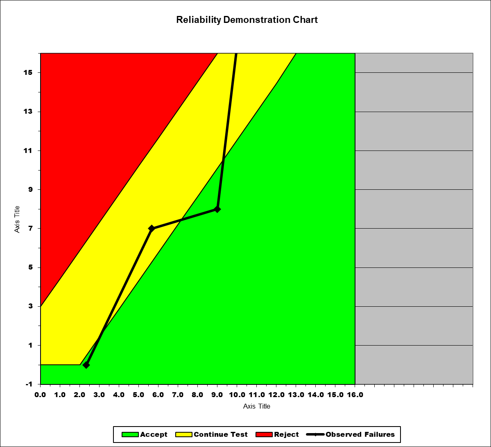
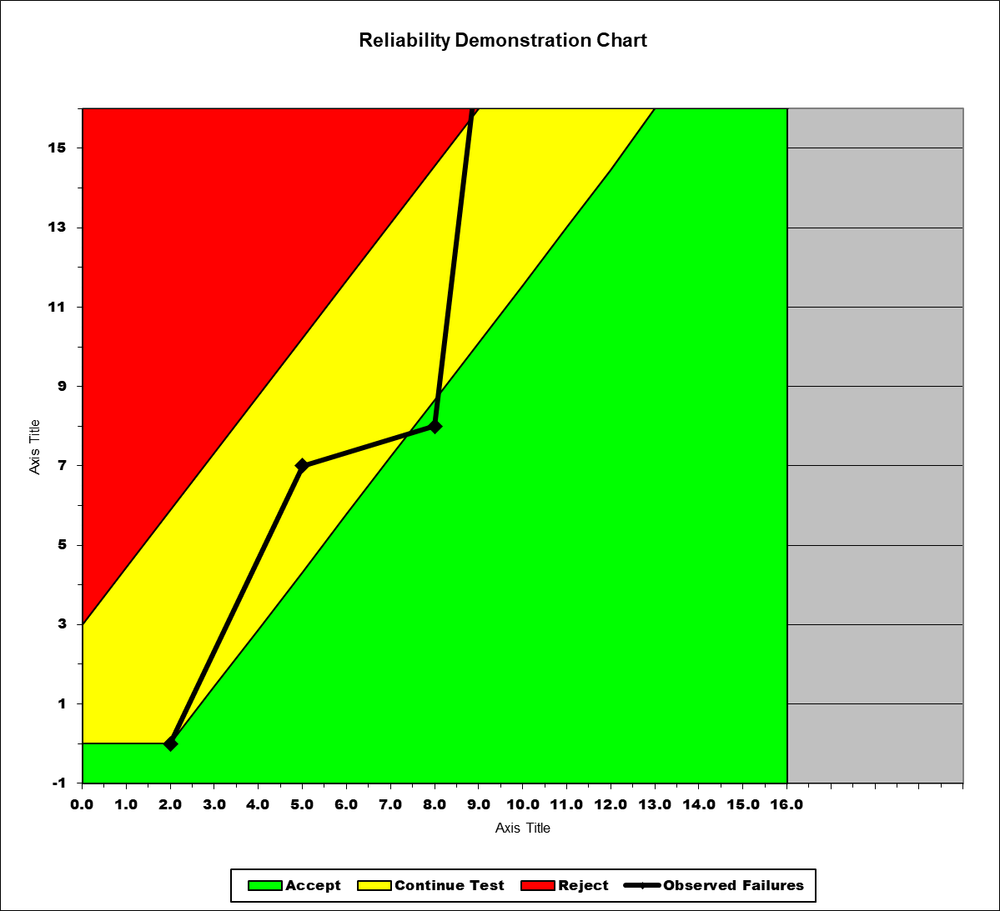
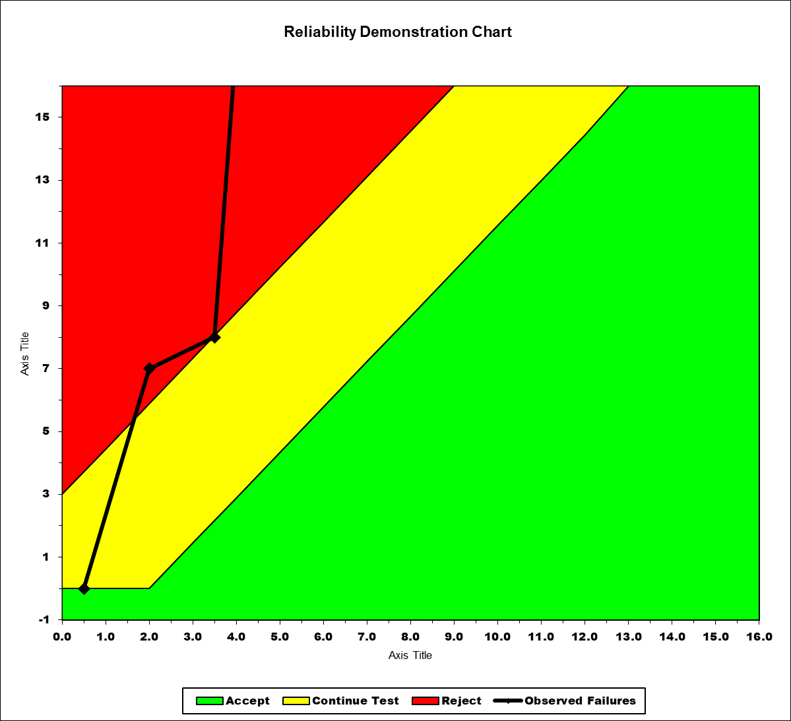

**SENG 438- Software Testing, Reliability, and Quality**

**Lab. Report \#5 – Software Reliability Assessment**

| Group \#:             |     |
| --------------------- | --- |
| Student Names:        |     |
| Carlos Morera Pinilla |     |
| Neil Adrian Sarmiento |     |
| Hassan Anwar          |     |
| Toshi Biswas          |     |

# Introduction

The purpose of this lab was to get familiar with recording failure rate using plots from a reliabiity assesment tool such as SRTAT
to assess the reliability over time of a SUT as it gets used more and more often over longer periods of time.

#

# Assessment Using Reliability Growth Testing

We tried running a LaPlace test to get the proper range of data, but it didn't work on our operating systems. However, due to our relatively small amount of data, omitting this step was deemed acceptable.

# Assessment Using Reliability Demonstration Chart

Our MTTFmin was based on the fact that it provides the line of best fit such that it is the lowest acceptable MTTF that the system would accept, we based that on experementing with the excel file after creating a plot and using the LOBF feature to create an approximate linear equation.

# Comparison of Results

Given the plots, it is clear that RGT is dynamic as the plots are a smooth exponential flow based on time that the system is used and is useful in predicting potential bugs and WHEN the system could fail.

Whereas RDC the plot is more static, akin to a piecewise function because it takes the current data and predicts how LIKELY the system is to fail if we continue to stress it.

# Discussion on Similarity and Differences of the Two Techniques

Both techniques stress the system and are useful for evaluating the dependibility of the system and must depend on accurate data to form the plots of failure. Thirdly, both methods pinpoint the areas of the system that lack reliability. Finally, both methods allow the analyzer to determine whether the desired level of reliability has been achieved.

While RGT, is used to predict a systems dependability in the future and assess how the system will perfom if we continue to stress it over time.
With RDC, we check to see if the given we calculated is met as the system is constantly put under stress. Basically its a check.

RGT is also dynamic, it changes as we collect more and more data in our system. RDC is static, and only shows the current data and the current failure AT A PARTICULAR POINT IN TIME.

RGT is better at detecting potential and current bugs, while RDC is better at making sure the software satisifies reliability requirements with the given data we have.

# How the team work/effort was divided and managed

Neil did the plotting for the graphs and some of the write up for the lab. Carlos did majority of the lab write up.

# Difficulties encountered, challenges overcome, and lessons learned
During this lab, we had trouble figuring out what tasks we were supposed to do. The assignment guideline didn't have enough details, which made it harder for us. But we were able to overcome this by working together and using external resources to understand the software better.

This experience taught us an important lesson as engineering students. It's crucial to learn about the software before using it. At first, we had a hard time using the software because we didn't understand how it worked. So, we learned that it's essential to educate ourselves about the software's features before using it to avoid similar problems in the future.

# Comments/feedback on the lab itself

Our group noticed significant deviations between this lab and the previous four. Although we acquired useful knowledge that enhanced our understanding of the course material, we struggled initially due to the insufficient guidance presented in the assignment guidelines. In our view, it would be advantageous for future students to have access to more detailed instructions and software that works seamlessly with modern operating systems.
